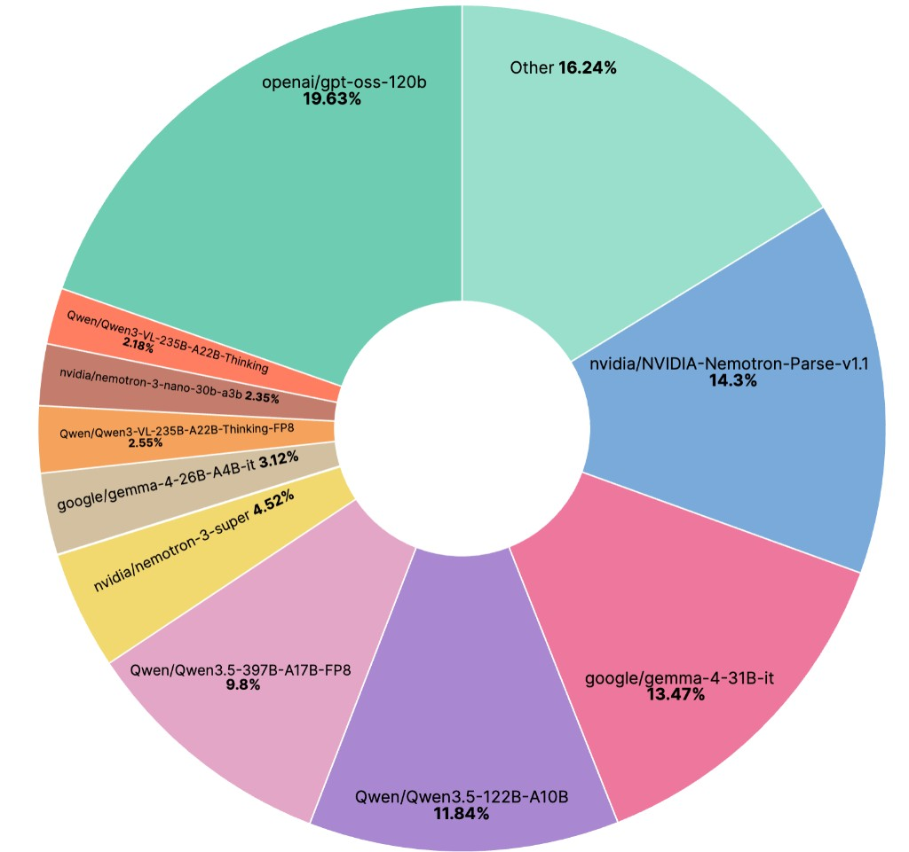

# 🎨 NeMo Data Designer

[](https://github.com/NVIDIA-NeMo/DataDesigner/actions/workflows/ci.yml)
[](https://opensource.org/licenses/Apache-2.0)
[](https://www.python.org/downloads/) [](https://docs.nvidia.com/nemo/microservices/latest/index.html) [](https://nvidia-nemo.github.io/DataDesigner/) 

**Generate high-quality synthetic datasets from scratch or using your own seed data.**

---

## Welcome!

Data Designer helps you create synthetic datasets that go beyond simple LLM prompting. Whether you need diverse statistical distributions, meaningful correlations between fields, or validated high-quality outputs, Data Designer provides a flexible framework for building production-grade synthetic data.

## What can you do with Data Designer?

- **Generate diverse data** using statistical samplers, LLMs, or existing seed datasets
- **Control relationships** between fields with dependency-aware generation
- **Validate quality** with built-in Python, SQL, and custom local and remote validators
- **Score outputs** using LLM-as-a-judge for quality assessment
- **Iterate quickly** with preview mode before full-scale generation

---

### ⚠️ Security Notice: LiteLLM Supply-Chain Incident (2026-03-24)

On March 24, 2026, malicious versions of `litellm` ([1.82.7 and 1.82.8](https://github.com/BerriAI/litellm/issues/24518)) were published to PyPI containing a credential stealer. The compromised packages were available for [approximately five hours](https://www.okta.com/blog/threat-intelligence/litellm-supply-chain-attack--an-explainer-for-identity-pros/) (10:39 – 16:00 UTC) before being removed.

The only Data Designer releases that could resolve to these versions are **v0.2.2** (Dec 2025) and **v0.2.3** (Jan 2026), which carried a looser `litellm<2` upper bound. These are nearly three months old and have been superseded by eight subsequent releases — both have been yanked from PyPI as a precaution. All other releases (v0.3.0 – v0.5.3) pinned `litellm` to `>=1.73.6,<1.80.12` and were never compatible with 1.82.x. Starting with v0.5.4, `litellm` is no longer a dependency.

To have been impacted through Data Designer, you would need to have had one of these two old versions explicitly pinned *and* run a fresh `pip install` or dependency-cache update that resolved `litellm` during the five-hour window on March 24. If you believe you may be affected, see [BerriAI's incident report](https://github.com/BerriAI/litellm/issues/24518) for remediation steps.

---

## Quick Start

### 1. Install

```bash
pip install data-designer
```

Or install from source:

```bash
git clone https://github.com/NVIDIA-NeMo/DataDesigner.git
cd DataDesigner
make install
```

### 2. Set your API key

Start with one of our default model providers:

- [NVIDIA Build API](https://build.nvidia.com)
- [OpenAI](https://platform.openai.com/api-keys)
- [OpenRouter](https://openrouter.ai)

Grab your API key(s) using the above links and set one or more of the following environment variables:
```bash
export NVIDIA_API_KEY="your-api-key-here"

export OPENAI_API_KEY="your-openai-api-key-here"

export OPENROUTER_API_KEY="your-openrouter-api-key-here"
```

### 3. Start generating data!
```python
import data_designer.config as dd
from data_designer.interface import DataDesigner

# Initialize with default settings
data_designer = DataDesigner()
config_builder = dd.DataDesignerConfigBuilder()

# Add a product category
config_builder.add_column(
    dd.SamplerColumnConfig(
        name="product_category",
        sampler_type=dd.SamplerType.CATEGORY,
        params=dd.CategorySamplerParams(
            values=["Electronics", "Clothing", "Home & Kitchen", "Books"],
        ),
    )
)

# Generate personalized customer reviews
config_builder.add_column(
    dd.LLMTextColumnConfig(
        name="review",
        model_alias="nvidia-text",
        prompt="Write a brief product review for a {{ product_category }} item you recently purchased.",
    )
)

# Preview your dataset
preview = data_designer.preview(config_builder=config_builder)
preview.display_sample_record()
```

---

## What's next?

### 📚 Learn more

- **[Getting Started](https://nvidia-nemo.github.io/DataDesigner/latest/)** – Install, configure, and generate your first dataset
- **[Tutorial Notebooks](https://nvidia-nemo.github.io/DataDesigner/latest/notebooks/)** – Step-by-step interactive tutorials
- **[Column Types](https://nvidia-nemo.github.io/DataDesigner/latest/concepts/columns/)** – Explore samplers, LLM columns, validators, and more
- **[Validators](https://nvidia-nemo.github.io/DataDesigner/latest/concepts/validators/)** – Learn how to validate generated data with Python, SQL, and remote validators
- **[Model Configuration](https://nvidia-nemo.github.io/DataDesigner/latest/concepts/models/model-configs/)** – Configure custom models and providers
- **[Person Sampling](https://nvidia-nemo.github.io/DataDesigner/latest/concepts/person_sampling/)** – Learn how to sample realistic person data with demographic attributes

### 🔧 Configure models via CLI

```bash
data-designer config providers # Configure model providers
data-designer config models    # Set up your model configurations
data-designer config list      # View current settings
```

### 🤖 Agent Skill

Data Designer has a [skill](https://nvidia-nemo.github.io/DataDesigner/latest/devnotes/data-designer-got-skills/) for coding agents. Just describe the dataset you want, and your agent handles schema design, validation, and generation. While the skill should work with other coding agents that support skills, our development and testing has focused on [Claude Code](https://code.claude.com) at this stage.

**Install via [skills.sh](https://skills.sh)** (be sure to select Claude Code as an additional agent):

```bash
npx skills add NVIDIA-NeMo/DataDesigner
```

After installation, type `/data-designer` or describe the dataset you want and the skill will kick in.

### 🤝 Get involved

This repository supports agent-assisted development — see [CONTRIBUTING.md](CONTRIBUTING.md) for the recommended workflow.

- **[Contributing Guide](CONTRIBUTING.md)** – How to contribute, including agent-assisted workflows
- **[GitHub Issues](https://github.com/NVIDIA-NeMo/DataDesigner/issues)** – Report bugs or make a feature request

---

## Telemetry

Data Designer collects telemetry to help us improve the library for developers. We collect:

* The names of models used
* The count of input tokens
* The count of output tokens

**No user or device information is collected.** This data is not used to track any individual user behavior. It is used to see an aggregation of which models are the most popular for SDG. We will share this usage data with the community.

Specifically, a model name that is defined a `ModelConfig` object, is what will be collected. In the below example config:

```python
ModelConfig(
    alias="nv-reasoning",
    model="nvidia/nemotron-3-super-120b-a12b",
    provider="nvidia",
    inference_parameters=ChatCompletionInferenceParams(
        temperature=1.0,
        top_p=0.95,
        max_tokens=4096,
    ),
)
```

The value `nvidia/nemotron-3-super-120b-a12b` would be collected.

To disable telemetry capture, set `NEMO_TELEMETRY_ENABLED=false`.

### Top Models

This chart represents the breakdown of models used for Data Designer across all synthetic data generation jobs from 2/23/2026 to 3/23/2026.



_Last updated on 3/23/2026_

---

## License

Apache License 2.0 – see [LICENSE](LICENSE) for details.

---

## Citation

If you use NeMo Data Designer in your research, please cite it using the following BibTeX entry:

```bibtex
@misc{nemo-data-designer,
  author = {The NeMo Data Designer Team, NVIDIA},
  title = {NeMo Data Designer: A framework for generating synthetic data from scratch or based on your own seed data},
  howpublished = {\url{https://github.com/NVIDIA-NeMo/DataDesigner}},
  year = {2025},
  note = {GitHub Repository},
}
```
